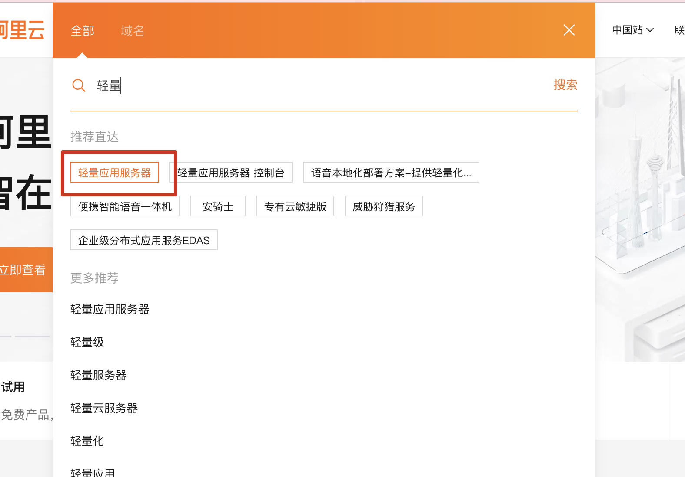
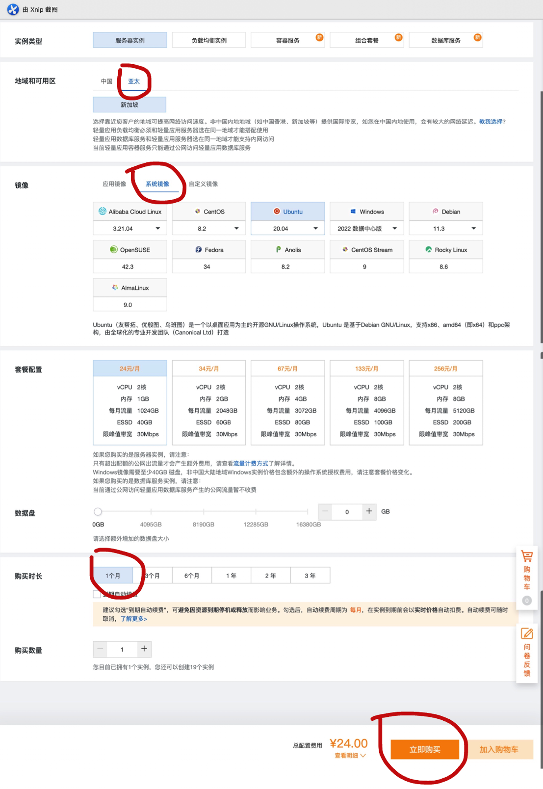
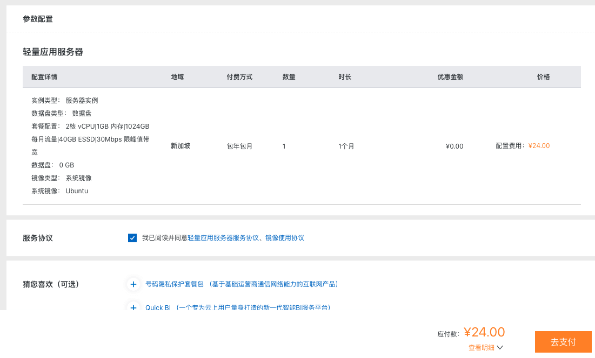

动不动ban我域名，看样子这篇文章在域名到期前别想放出来了

<!--

使用服务商提供的梯子，访问chatgpt时经常会报

> too many requests in 1 hour

由于服务商提供的节点多数是共享的，一个节点可能有n个人同时使用。那么chatgpt会针对这个节点的整体访问次数进行检测并限制。

原先还好些，连续提问没什么问题。最近只要提问一两次就提示访问次数过多了。所以才想着自己购买服务器搭建一个私人专属的vpn。阿里云的轻量服务器一台一个月只要二十多块钱。所以今天就买了台搭建。

速度飞快！真的飞快。二十来块钱就能办到了。不比花几十上百买一个和nnnnn个人共享的节点香么？

## 一、购买服务器

1. 访问[阿里云官网](https://account.aliyun.com/login/login.htm)，并登录/注册，可以使用支付宝账号。

2. 登录后，点击搜索按钮，输入“轻量”，选择轻量应用服务器，点击进入。




3. 点击购买，进入购买页面，按下图配置





## 二、配置域名给服务器

支付完毕后，回到首页，然后点击访问[控制台](https://swas.console.aliyun.com/servers#/servers)


然后，点击该服务器进入你的服务器的控制台，并复制公网ip，之后要使用。


上方搜索“云解析dns”点击进入


在你的域名列表点击“解析设置”


点击添加记录


填写域名前缀，并将之前复制的公网ip粘贴进这里，点击确定。


回到该服务器的控制台的首页，点击重置密码，进行密码重置。完成后重启服务器


## 三、连接服务器

以mac电脑为例：

1. 打开终端，在顶部菜单栏点击 shell - 新建远程连接
   
   
4. 在命令行中输入你的密码，登录成功。

   


如果你是windows电脑，可以使用一些第三方集成的终端（如PowerShell等），或者直接使用ssh命令进行连接。

## 四、安装与配置运行环境

在该终端中做如下操作

1. 开启防火墙，完成后重启服务器

```bash
iptables -P INPUT ACCEPT 
iptables -P FORWARD ACCEPT 
iptables -P OUTPUT ACCEPT 
iptables -F apt-get purge netfilter-persistent
```

2. 申请SSL证书

```bash
apt update -y       # Debian/Ubuntu 命令 
apt install -y curl   # Debian/Ubuntu 命令 
apt install -y socat  # Debian/Ubuntu 命令 
```
或者
```bash
yum update -y        #CentOS 命令 
yum install -y curl    #CentOS 命令 
yum install -y socat   #CentOS 命令 
curl https://get.acme.sh | sh ~/.acme.sh/acme.sh --register-account -m example@xx.com（example@xx.com替换成自己的邮箱）
```

3. 开始申请证书

```bash
~/.acme.sh/acme.sh --issue -d www.bbdcsg.love --standalone   #将www.bbdcsg.love替换成自己解析好的域名
```

4. 安装证书

```bash
~/.acme.sh/acme.sh --installcert -d www.bbdcsg.love --key-file /root/private.key --fullchain-file /root/cert.crt    #www.bbdcsg.love替换成自己解析好的域名
```

- 此时，在root目录下可看到证书公钥`/root/cert.crt`及验证文件`/root/private.key`

  

5. 安装X-UI面板，并通过终端的界面，设置用户名、密码、端口等等。

```bash
bash <(curl -Ls https://raw.githubusercontent.com/vaxilu/x-ui/master/install.sh)
```

使用方法是输入x-ui，然后输入对应的命令，根据命令提示进行设置，这里就不操作了。


## 五、在浏览器中访问X-UI面板

在浏览器中输入`ip:端口号`或者`域名:端口号`访问链接

如，我配置的域名为`www.abc.com`，配置的端口为1111，那么就是www.abc.com:1111

输入你设置的用户名、密码，登录成功后，点击“+”，并确认。

点击 “入站列表 - 详细信息 - 查看”，点击“复制链接”


## 六、安装基于v2ray核心的GUI工具

下载链接：[点击这里](https://v2xtls.org/v2ray-mac%E5%AE%A2%E6%88%B7%E7%AB%AF%E4%B8%8B%E8%BD%BD/)

几个工具功能都差不多，是我实测都比较好用的工具。配置方法也都差不多。

这里我下的是V2rayU


下载完成后安装，安装完成后，在顶部会出现一个小图标


点击它，点击“从粘贴板导入”


然后，在服务器列表中就会出现，点击选中它，表示我们用这个服务器进行代理。


点击Turn v2ray-core on，即可开启代理。


最后，选择路由设置 - 路由模式 - 绕过大陆和局域网 即可。


然后就可以访问外站了，速度飞快，但是不可以干坏事。


-->