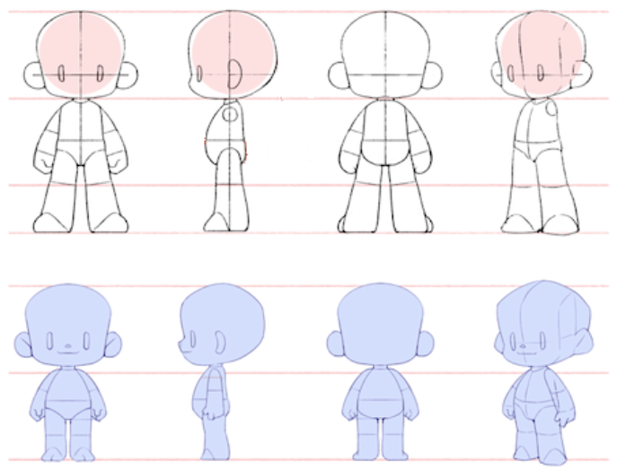
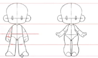

## 一、三头身和二头身

### 基本比例

肩宽（六头身）：男四头宽，女三头宽

肩宽（q版）：男 -----> 三个脖子。女 -----> 两个

检查原则：肩膀是溜肩，肩宽小于头，侧身不要太薄

### 手的绘画

将手简化为如下的三部分结构，手掌、手指、拇指

画出基本结构后，根据基本结构进行细化

## 二、 变形的方向

下图中的每个颜色代表一个结构，通过改变每个结构的大小，做人体的变形。

趋同和差异：通过改变每部分的比例，去做趋同和差异。当比例接近则为趋同，当比例变大则为差异。

趋同时要注意：保留特征的趋同。而不能过分趋同以至于让物体的特征不明显。

差异：将特征放大，将非特征减少。

这个课程的内容基本就是做趋同。我平时好像是比较喜欢做差异。

## 绘画的步骤：

### 1. 提取1级形33333

拿到照片，先概括大形状                             

### 2. 趋同

根据大形状，自己处理比例

### 3. 可以背下来这些形状进行素材积累吖，建立自己的形体库吖

形体相同，内容圣斗

## 三、 人体比例

