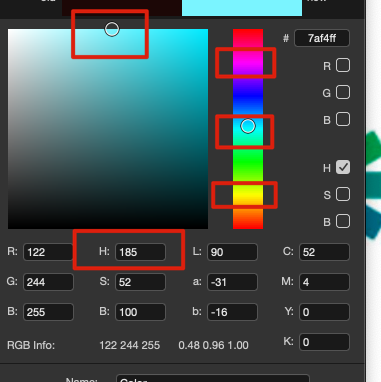

## 一、 配色

### 1. 靠刻板印象配色

画画前想好自己要画什么，比如说

性格（少女？甜美？帅气？硬朗？）？

性别（男？女？）？

季节（春？夏？秋？冬？）

时间（早？中？晚？）

总结一些关键词，从这些关键词中，会进一步联想到的颜色。比如说甜美、少女 ---> 粉，然后就去想想关注过什么画粉画的很好的画师，然后去找参考。而不是上来就搜少女配色，那搜出来的不太精确。所以平时要多积累。

### 2. 自然色

大自然中很多物品的配色是很和谐的吖，比如说水果吖什么的。

### 3. PCCS色调图

见文章 [PCCS色调图](https://bbdcsg.love/2023/08/07/PCCS/)

### 4. 配色方式

拿到喜欢的参考图，分析

明度对比？几比几

色相对比？几比几

饱和度对比？几比几

分析画面的时候，吸色没关系的拉。

一张图好看的原因吖，无外乎是造型？颜色？光影？刻画？需要好好的分析吖

最好去找一个作者的多张图，而不是多张图不是第一个作者。

具体步骤：

+ 判断图中配色是PCCS的哪个区间？
+ 自己配色选取该区间
+ 处理线稿

**线稿的处理：基色的基础上，饱和度增加，明度降低。**

### 5. 荧光色（青品黄）的配色：

+ 画画时明度达到100%是最好的，如果更改明度会变脏。
+ 更改明度的方法，可以通过更改一点点色相的方式。
+ 不要饱和度达到100%，最好的区间是50%左右（及以下）

阴影色：像红绿蓝偏移，（可以适当升高饱和度），不要直接去更改明度

## 二、材质*

材质的话最好找平面的图，而不是真的材质吖。

