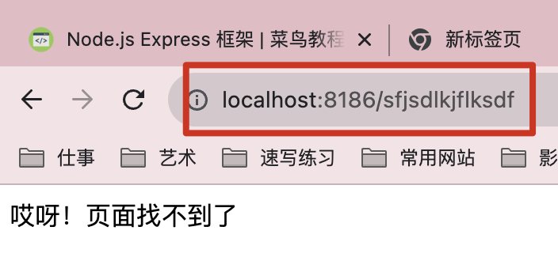

## 六、使用express来处理http请求

### 1.  什么是express

Node.js的Express是一个流行的Web应用程序框架，它可以帮助你构建具有后端功能的Web应用程序。Express使得创建服务器和路由处理非常简单，并提供了许多有用的功能，如处理HTTP请求、路由管理、模板引擎支持等。

#### 简单代码举例：

```js
// 1. 导入exprss
const express = require("express");
// 2. 创建应用对象
const app = express();
// 3. 创建路由
app.get("/home", (req, res) => {
	res.end("express");
});
// 4. 监听端口
app.listen(8186, () => {
	console.log("8186 is on!");
});

```

访问`http://localhost:8186/home`，浏览器返回


当然，使用前需要安装express。

### 2. restful api请求

路由按照顺序从上往下匹配

#### 一般方法

express可以发送restful api符合的所有请求类型。

（post delete put get 再加俩head option）

```js
const express = require("express");
const app = express();

// 响应get请求
app.get("/home", (req, res) => {
	res.end("homepage");
});

// 响应post请求
app.post("/login", (req, res) => {
	res.end("login");
});
// 注意post请求的发送要通过前端ajax过来（表单也可以），地址栏不可以直接写/login，那发送的是get请求

app.listen("8186", () => {
	console.log("server start!");
});

```

#### app.all()

表示无论发送的请求类型是什么，只要地址匹配，就会进行响应。一般用于在用户访问错误的地址时，给一个提示页面。

```js
app.all("*", (req, res) => {
	res.setHeader("content-type", "text/html;charset=utf-8");
	res.end("哎呀！页面找不到了");
});
```

当我输入一个错误的地址时，浏览器显示如下



### 3. 获取请求内容

express除了兼容原生的请求报文提取，还封装了一些新的提取方式。

### 基本方法

`req.get(header)`: 获取请求头相关，header是字符串，表示需要获取的请求头名称。

`req.path`: 获取请求的路径

`req.query`: 获取请求的query

`req.ip`: 获取请求的ip

```js
const express = require("express");
const app = express();

// 响应get请求
app.get("/home", (req, res) => {
	// nodejs的获取方式
	console.log(req.method);
	console.log(req.headers);
	console.log(req.url);

	// express的获取方式
	console.log(req.path); // 获取请求路径
	console.log(req.query); // 获取请求的query对象
	console.log(req.ip); // 获取ip
  console.log(req.get("Accept")); // 获取Accept请求头

  
	res.end("opened!");
});

app.listen("8186", () => {
	console.log("server start!");
});

```

当访问http://localhost:8186/home?a=aaa&b=bbb时


可以看到通过express方式获取的请求数据会比较方便

### 4.  设置动态路由

当不确定访问地址是什么的时候，可以动态匹配占位符（：），然后使用`req`动态获取。

`req.params`: 获取动态路由的参数对象

```js
const express = require("express");
const app = express();

// 访问一个商品页面，product_id来区分商品
app.get("/:product_id/detail", (req, res) => {
	const product_id = req.params.product_id;
	res.setHeader("content-type", "text/html;charset=utf-8");
	if (product_id.length !== 10) {
		res.end("哎呀！页面找不到了");
	} else {
		res.end(`${product_id}的商品页面`);
	}
});

app.listen(8186, () => {
	console.log("server start!");
});
```

当访问http://localhost:8186/1020304034/detail时，返回如下：


当商品id不是十位时，返回如下：


### 5. 设置响应的内容

express除了支持原生的获取响应体方式之外，还提供了额外的方法。

- `res.status(n:number)` 状态码
- `res.set(header:string,content:string)` 设置
- `res.send(content:string)` 内容屏。

```js
const express = require("express");
const app = express();

app.get("/", (req, res) => {
	res.status(200);
	res.set("1234567", "7654321");
	res.send("express start!");

	// 链式调用都ok
	// res.status("200").set("111", "222").send("express start");
});

app.listen(8186, () => {
	console.log("server start!");
});

```


### 6. 其他的相应类型

### 下载

下载文件

```js
res.download(url)
```

或

```js
res.download(json)
```

### JSON

```js
res.json(json)
```

### redirect

使访问网站重定向到一个新的url。返回状态码为302

```js
res.redirect(url)
```

### sendFile

将文件发送到浏览器。比如json、html等等吖

```
res.sendFile(url)
```

简单示例：

```js
const express = require("express");
const http = require("http");
const path = require("path");
const app = express();
app.get("/", (req, res) => {
	console.log(req.method);
	// res.json({
	// 	a: "b",
	// });
	const downloadUrl = path.resolve(__dirname, "package.json");
	res.download(downloadUrl);
	res.sendFile(downloadUrl);
	res.redirect("https://www.bbdcsg.fun");
});

app.listen(8106, () => {
	console.log("server start!");
});

```

## 七、中间件

当用户访问时，会首先访问中间件，然后再去执行路由的内容。

+ 中间件的本质是一个回调函数。
+ 在中间件函数中可以像路由毁掉一样访问req和res
+ express可以自定义中间件，使用app.use()进行调用，也可以使用内置的中间件。

### 如何理解的中间件呢？

想象一下你去一家餐厅吃饭，中间件就像服务员在你点菜后将菜单传递给厨房的过程。在这个过程中，服务员可以检查菜单上的信息、将订单记录在点菜单上、通知厨师制作食物、检查食物是否符合你的要求，并最终将食物送回你的桌子上。中间件在你点菜和享受美食之间执行了一系列操作，就像在请求和响应之间执行的代码一样。

### 1. 自定义全局中间件

当用户访问时，会首先执行全局中间件，然后再去执行路由的内容。

比如：需要一个服务器日志，当用户访问时，需要服务端记录访问的路径，访问的是谁，访问的时间，访问的次数等等。

### 示例

存在index和detail两个地址，需要记录用户访问他们的时间、地址、ip，可以用以下方式实现

```js
const express = require("express");
const fs = require("fs");
const app = express();

app.get("/", (req, res) => {
  // 获取url和ip
	const { url, ip } = req;
  // 向log中追加用户访问信息
	fs.appendFileSync(
		"log.txt",
		`${new Date().getFullYear()}/${new Date().getDate()} ${new Date().getHours()}:${new Date().getMinutes()}:${new Date().getSeconds()} ${
			new Date().getMonth() + 1
		}${url} ${ip}\r\n`,
	);
	res.end("index");
});

app.get("/detail", (req, res) => {
   // 获取url和ip
	const { url, ip } = req;
   // 向log中追加用户访问信息
	fs.appendFileSync(
		"log.txt",
		`${new Date().getFullYear()}/${
			new Date().getMonth() + 1
		}/${new Date().getDate()} ${new Date().getHours()}:${new Date().getMinutes()}:${new Date().getSeconds()} ${url} ${ip}\r\n`,
	);
	res.end("detail");
});
app.listen(8106, () => {
	console.log("server start!");
});


```

执行结果：


虽然可以实现功能，你会发现，两个路由中，有很大一部分都是重复的。都是获取url和ip，并像log中追加相同内容。

如果路由有成千上万个的话，每一个都写相同的一部分是冗余的。

这时候我们就可以将其提取出来，作为中间件去执行。

### 中间件写法

先声明中间件函数，然后使用`app.use()`去执行中间件函数。

```js
const express = require("express");
const fs = require("fs");
const app = express();

// 中间件函数
function middleFun(req, res, next) {
	// next参数表示执行完中间件的回调函数，调用后会继续执行路由内的操作
	const { url, ip } = req;
	fs.appendFileSync(
		"log.txt",
		`${new Date().getFullYear()}/${
			new Date().getMonth() + 1
		}/${new Date().getDate()} ${new Date().getHours()}:${new Date().getMinutes()}:${new Date().getSeconds()} ${url} ${ip}\r\n`,
	);
  // 执行next，以继续路由内的操作
  next();
}
// 使用app去执行
app.use(middleFun);

app.get("/", (req, res) => {
	res.end("index");
});

app.get("/detail", (req, res) => {
	res.end("detail");
});
app.listen(8106, () => {
	console.log("server start!");
});

```

结果


### 2. 自定义路由中间件

只在某些路由中起作用的中间件。一般在校验用户是否有权限时可以使用的。

比如，有路由`index`、`detail`、`list`，当满足`query`中有参数`login=true`时，允许访问`detail`，否则返回提示"哎呀！页面找不到了"

### 步骤

1. 创建路由中间件函数
2. 在需要配置该中间件的路由中，加入该函数

```js
const express = require("express");
const fs = require("fs");
const app = express();

function middleFun(req, res, next) {
	const query = req.query;
	if (query.login === true) {
		// 当query.login为true时，执行路由内的内容
		next();
	} else {
		// 当query.login为false时，返回提示内容
		res.send("哎呀！页面找不到了");
	}
}

// 为需要满足路由中间件规则的内容写上第二个参数，参数为中间件函数的函数名
app.get("/detail", middleFun, (req, res) => {
	res.send("detail");
});

// 为需要满足路由中间件规则的内容写上第二个参数，参数为中间件函数的函数名
app.get("/list", middleFun, (req, res) => {
	res.send("list");
});

app.get("/", (req, res) => {
	res.end("index");
});
app.listen(8106, () => {
	console.log("server start!");
});

```

### 3. express内置的中间件

express内置的中间件和自定义的全局中间件一样，使用app.use()调用

常用的内置的中间件类型有：

1. **express.json()**：这个中间件用于解析传入的 JSON 请求体。它会将请求体解析为 JavaScript 对象，以便在后续的路由处理中使用。
2. **express.urlencoded()**：类似于 `express.json()`，这个中间件用于解析传入的 URL 编码形式的请求体，通常用于处理表单提交。
3. **express.static()**：这个中间件用于提供静态文件（如 CSS、JavaScript 和图像）的服务。你可以指定一个目录，Express 会从该目录中提供文件，以便客户端可以访问它们。
4. **express.Router()**：`express.Router()` 是用于创建可重用路由器的中间件。你可以将路由器与不同的路径挂载到应用程序中，以便将请求分发给不同的路由处理函数。
5. **express.jsonp()**：这个中间件用于支持 JSONP（JSON with Padding）响应，允许跨域请求并接收 JSONP 格式的响应。
6. **express.raw()**：类似于 `express.json()`，这个中间件用于解析传入的原始二进制数据请求体。
7. **express.text()**：类似于 `express.json()`，这个中间件用于解析传入的文本数据请求体。

### 静态资源中间件

这里以静态文件中间件进行举例，比如说在网站目录下有一个`public`文件夹用于存放静态资源类型。

需要实现：当用户访问`网址/资源名`时，可以读取到public内的静态文件。

示例：

```js
const express = require("express");
const path = require("path");
const app = express();

// 获取public文件夹路径
const url = path.resolve(__dirname, "public");
app.use(express.static(url));

app.listen(8106, () => {
	console.log("server start!");
});

```

此时访问`http://localhost:8106/WechatIMG70.jpeg`可以返回public文件夹下的这张图片。

注意点： 

+ 静态资源中间件也遵循自上而下匹配的顺序
+ 路由一般用于响应动态资源，静态资源一般用静态资源中间件响应。

## 八、body-parser的使用

**简介**：这个中间件用于解析 HTTP 请求体，特别是解析 POST 请求中的表单数据或 JSON 数据。它可以将请求体数据解析为 JavaScript 对象，便于在应用程序中处理。


## 九、使用express实现防盗链

### 防盗链的功能

防盗链是一种阻止其他网站直接使用你的资源（如图片或视频）的方法，通常通过检查请求来源或生成临时链接来实现。这有助于保护你的资源不被未经授权的网站盗用。

### 防盗链的视线

**原理**： 通过中间件，判断请求头的`refer`是否为当前域名。

**核心代码**：

当域名不为localhost时，无法获取资源（用127.0.0.1也获取不到）。

```js
app.use((req,res,next)=>{
  // 首次访问任何网站时，refer都为空，要注意判断这种情况吖！
  if(req.get('refered') === 'localhost') || !req.get('refered') {
    next()
  } else {
    res.status(404).send('not founded!')
  }
})
```

## 十、 模块化

当路由增多时，可以使用模块化进行导入。

+ 封装后可以将文件体积减小，冲突的几率也变小了。
+ 方便管理
+ 易于开发了

模块化：

导出：`module.exports`

导入：`require`

